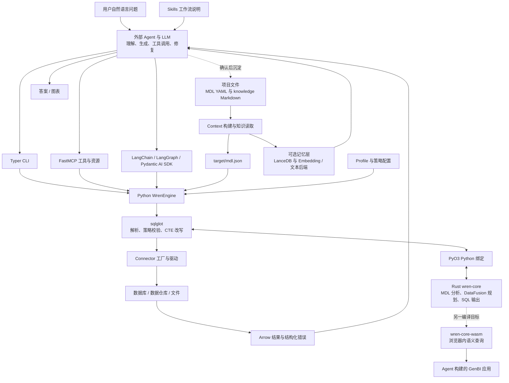
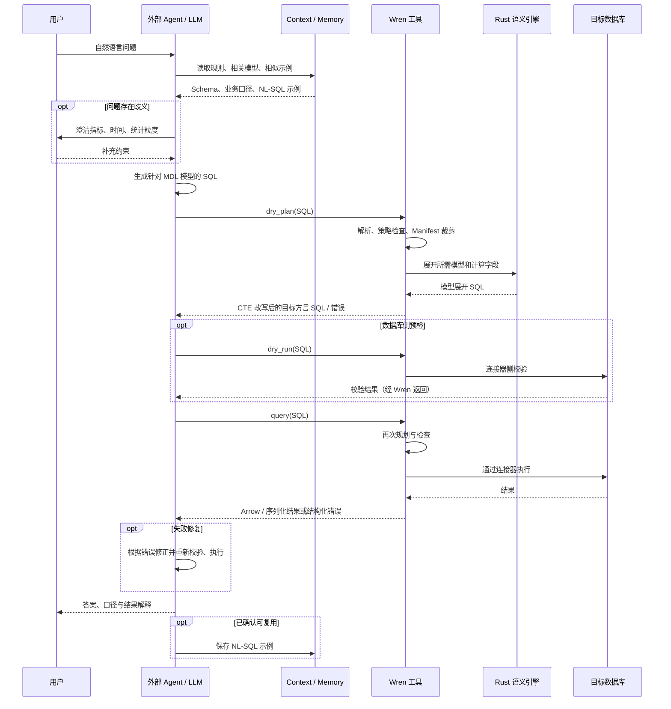

# WrenAI 中文学习指南：架构、Text2SQL 全流程与项目实践

本文面向希望理解实现原理、复现方案并用于求职交流的开发者。分析基于本地代码快照 `871118e9`，重点以实际调用链为依据；安装命令是学习操作说明，不代表本文已经运行数据库或完成准确率评测。

**最核心的设计：Agent 负责理解问题和生成 SQL，Wren 负责提供业务语义、检索上下文、编译 SQL、校验与执行。** 可靠性来自这些环节共同工作，而不是仅靠一段 Prompt。

你的已知背景：之前做过 Text2SQL 项目，目标岗位是 Agent 开发。你提供的分享记录在本次访问中未能读取，因此本文不推断旧项目的框架、实现细节或成绩；最后的路线按这一已知背景定制，简历表述仍需实际证据填充。

## 1. 先确认你在学习哪个版本

当前主线是面向 Agent 的开放上下文层与语义引擎。根据仓库说明，旧版 `wren-ui/`、`wren-ai-service/`、`wren-launcher/`、`docker/`、`deployment/` 已迁到 `legacy/v1` 分支，保留标签 `v1-final`。

因此，不应把旧版“聊天前端 → AI Service → 向量库 → Engine”的部署图直接套在当前代码上。本文完整描述当前工作区架构；历史产品的服务编排、提示词流水线需要另行查看历史分支。

还有两个容易误解的入口：

- `wren ask "问题" --guided`：渲染工作流提示词并输出，不调用 LLM、不执行查询。见 [ask.py](core/wren/src/wren/ask.py)。
- `wren genbi build`：生成带项目上下文的建站指令，由 Agent 实际编写应用。见 [composer.py](core/wren/src/wren/genbi/composer.py)。

## 2. 项目要解决什么问题

假设用户问：“上季度销售额最高的十位客户是谁？”直接把数据库 DDL 交给 LLM，仍然无法唯一确定：

- 销售额是支付金额、含税金额，还是扣除退款后的净收入？
- 是否排除取消订单？时间按创建时间还是支付时间？
- “上季度”按哪个时区、自然季度还是财务季度？
- 客户、订单、支付明细怎样关联，是否会导致一笔订单重复累计？

Wren 把可重复使用的信息沉淀为三类资产：

| 资产 | 回答的问题 | 主要载体 |
| --- | --- | --- |
| 结构化语义 | 有哪些业务模型？字段、关系、计算公式是什么？ | MDL 模型、关系、视图、Cube |
| 业务知识 | 指标口径、枚举含义、特殊限制是什么？ | `knowledge/` 下的 Markdown |
| 已确认示例 | 类似问题过去如何正确查询？ | `knowledge/sql/`、派生的查询记忆索引 |

MDL 不只是供 LLM 阅读的描述：引擎会把它用于 SQL 编译。这使业务定义同时参与“生成前理解”和“生成后执行”。

## 3. 完整架构

### 3.1 分层与部署边界



这些方框主要是模块边界，不意味着每个都需要部署一个服务。CLI 与 SDK 通常在进程内调用 Python/Rust 引擎；MCP 暴露工具接口；数据库仍由对应数据源运行。向量索引是可选能力。

远端数据库路径主要在目标数据库执行计算；Rust/DataFusion 在这里承担语义规划和 SQL 生成。仓库也有 DataFusion 执行连接器和浏览器 WASM 路径，不能把所有运行方式都理解成远程 SQL 下推。

### 3.2 仓库模块地图

| 路径 | 职责 | 学习重点 |
| --- | --- | --- |
| [core/wren](core/wren) | Python SDK、CLI、MCP、上下文、记忆、连接器、Cloud/GenBI 工具 | 编排与模块接口 |
| [core/wren-core](core/wren-core) | Rust 语义引擎，基于 Apache DataFusion | 从模型到逻辑计划再到 SQL |
| [core/wren-core-base](core/wren-core-base) | Manifest、Model、Column、Relationship 等类型和 Builder | 跨语言数据契约 |
| [core/wren-core-py](core/wren-core-py) | PyO3 绑定，暴露 SessionContext、ManifestExtractor 等 | Python/Rust 边界 |
| [core/wren-core-wasm](core/wren-core-wasm) | Rust 引擎的 WebAssembly 构建 | 浏览器内查询数据 |
| [core/wren-mdl](core/wren-mdl) | MDL JSON Schema | 模型格式 |
| [sdk/wren-langchain](sdk/wren-langchain) | LangChain 工具集与 LangGraph 示例 | 工具调用循环与消息状态 |
| [sdk/wren-pydantic](sdk/wren-pydantic) | Pydantic AI 集成 | 类型化 Agent 工具 |
| [skills](skills) | Agent 发现入口 | 按需加载操作指南 |
| [core/wren/src/wren/skills_content](core/wren/src/wren/skills_content) | 随 CLI 发布的工作流正文 | 建模、知识整理、查询、GenBI |
| [evals](evals) | 场景评测材料与执行脚本 | 如何验证上下文是否有效 |
| [docs/core](docs/core) | 架构、概念、命令与 SDK 文档 | 辅助源码阅读 |

### 3.3 技术选型如何配合

| 技术 | 在本项目中的作用 |
| --- | --- |
| Python、Typer、Pydantic | 工具接口、CLI、配置与连接参数 |
| sqlglot | 按目标方言解析 SQL、识别表列、改写 AST、输出目标 SQL |
| Rust、DataFusion | 语义模型分析、逻辑计划转换与优化 |
| PyO3 | 将 Rust 能力提供给 Python |
| 原生数据库驱动与连接器 | 执行查询、dry-run、类型转换和资源释放 |
| PyArrow | 统一查询结果表示 |
| LanceDB | 可选的 Schema 与 NL-SQL 记忆索引 |
| sentence-transformers / ONNX Runtime | 可选的本地 Embedding 后端 |
| MCP、LangChain、Pydantic AI | 把底层能力接入外部 Agent |

注意部分仓库说明仍提到旧的 Ibis 通用连接器实现。当前 [connector/factory.py](core/wren/src/wren/connector/factory.py) 按模块分发，例如 PostgreSQL 已使用原生 psycopg3；不要把“Ibis 执行所有数据源”当作当前实现。

### 3.4 数据、配置和缓存放在哪里

```text
业务项目目录/
├── wren_project.yml          # 项目元数据、语义命名空间、profile 绑定
├── models/<模型>/metadata.yml
├── relationships.yml
├── views/<视图>/metadata.yml
├── cubes/<Cube>/metadata.yml
├── knowledge/
│   ├── rules/                # 业务规则
│   ├── glossary/             # 术语
│   ├── metrics/              # 指标知识
│   ├── caveats/              # 注意事项
│   └── sql/                  # 确认的 NL-SQL 示例
├── target/mdl.json           # 编译产物
└── .wren/memory/             # 可重建的可选索引

用户目录/.wren/
├── profiles.yml             # 数据源连接配置
├── config.json              # SQL 策略配置
└── cloud.yml                # 使用 Cloud 时的凭据配置
```

当前项目布局为 schema version 5，旧 `instructions.md`、`queries.yml` 存在兼容/迁移路径。YAML 使用 snake_case，编译后的 MDL JSON 使用 camelCase。项目级 `catalog/schema` 是 Wren 命名空间；模型的 `table_reference.catalog/schema` 才是物理数据位置。

CLI 项目索引与直接实例化 `WrenMemory()` 的默认目录也不同：后者默认 `~/.wren/memory/`。学习时显式区分项目资产与用户级运行配置。

### 3.5 扩展能力

- **dbt / OSI**：通过 [dbt.py](core/wren/src/wren/dbt.py)、[osi.py](core/wren/src/wren/osi.py) 等导入已有上下文，减少重复建模。
- **Cube**：将度量、维度、时间维度组织为可查询接口；CLI/MCP 可以据此构造聚合 SQL。
- **GenBI / WASM**：Agent 构建应用，WASM 可查询浏览器中的 JSON、CSV、Parquet 等数据；snapshot 模式随应用携带数据，live 模式连接外部 API，需要单独处理认证和数据访问。
- **Cloud Git Sync**：CLI 管理绑定与认证，项目资产通过 Git 同步；云端完整服务不是本地仓库中的另一套已展开后端。

源码中存在访问控制相关类型和规则，但这不等价于当前 OSS CLI 已提供完整的企业用户、群组和管理平台。产品边界见仓库 [原始 README](README.md) 与 [开源/商业说明](docs/core/concepts/oss_vs_commercial.md)。

## 4. Text2SQL：离线准备与在线问答

### 4.1 离线准备：先让系统知道数据的含义

1. **连接数据源**：建立 profile，确认数据库类型、表结构和连接能力。
2. **建立 MDL**：定义模型、物理映射、字段类型、主键、关系与计算列；通过 Agent 辅助或导入已有语义资产完成。
3. **整理业务知识**：记录指标公式、状态枚举、时间口径、单位和常见误区。
4. **编译与检查**：`wren context validate`、`wren context build`，得到 `target/mdl.json`。
5. **准备记忆**：按需要建立 Schema 索引，导入或沉淀 NL-SQL 示例。

建模不是把所有表名换成中文描述就结束。主键、关系基数和指标粒度，直接决定聚合是否会重复计算。

### 4.2 在线流程时序图



这是由现有工具支持的完整工作流，不是 `WrenEngine.query()` 内部固定执行的 LLM 流水线。是否澄清、检索、单独 dry-plan、重试和存储，取决于上层 Agent 的编排。执行方法自身仍会规划 SQL。

### 4.3 第一步：理解问题与 Schema Linking

Agent 将问题拆成指标、维度、过滤条件、时间范围、排序和返回数量，再与 MDL 对齐。例如“客户销售额 Top 10”需要识别客户维度、销售额计算列、时间字段和关联关系。

上下文来源可通过 CLI 的 `context show`、`memory fetch`、`memory recall`，或 MCP/SDK 的对应工具获取。MCP 还暴露 `get_mdl`、`list_models`、`describe_model`、`get_instructions`、`list_functions` 等能力。

不要把“Schema 检索”理解为已经生成 JOIN，也不要把问题中的业务词直接当成数据库中的值。例如“已支付”是否等于 `status = 2`，需要业务规则或数据证据。

### 4.4 第二步：检索上下文与相似 SQL

当前 [MemoryStore.get_context()](core/wren/src/wren/memory/store.py) 的实际策略：

| 条件 | 行为 | 设计含义 |
| --- | --- | --- |
| Schema 描述不超过默认 30,000 字符 | 返回完整 Schema 文本 | 小规模时避免 Top-K 漏掉必要关联 |
| 超过阈值 | 对问题做 Embedding，检索 Schema 项 | 大规模时控制上下文长度 |
| 向量检索 | 可按 MDL hash、模型名、条目类型过滤 | 约束命中范围与 Schema 版本 |
| 相似问题回忆 | 对自然语言问题做向量检索，返回 NL-SQL 对 | 提供 few-shot 示例 |
| 无向量依赖的项目示例回忆 | 文本后端对 Markdown 做 token 重合/子串匹配 | 让基本工作流不依赖模型下载 |

默认 Embedding 配置使用多语言 MiniLM，默认向量维度为 384；具体后端可选择 sentence-transformers 或 ONNX。详见 [embeddings.py](core/wren/src/wren/memory/embeddings.py)、[index_backend.py](core/wren/src/wren/memory/index_backend.py)。

这里不要凭文档中的“hybrid”就声称实现了 BM25 + 向量 + RRF + Cross-Encoder 重排。所检查的 `get_context()` 是全量/向量策略切换，`recall_queries()` 是向量召回；文本后端是另一种可选路径。

Schema 索引可生成 `source:seed` 标记的初始化示例。它们不同于人工确认的查询，不能把“索引里已有 SQL”当成业务正确性证明。

### 4.5 第三步：Agent 生成语义 SQL

LLM 依据问题、Schema、业务规则和示例，生成引用 MDL 模型名的 SQL。模型名可能与物理表名不同，计算列也可能根本不存在于数据库中。

当前没有必须使用的单一 LLM 提供商。一个清晰的可读实现是 [langgraph_demo.py](sdk/wren-langchain/examples/langgraph_demo.py)：

```text
START → agent 节点调用模型
           ├─ 有 tool_calls → ToolNode 执行工具 → 结果进入消息状态 → agent
           └─ 无 tool_calls → END
```

这是 ReAct 风格工具循环。它证明“模型调用位于哪里”，但示例本身不等于完整生产系统的重试预算、审计或会话治理方案。

### 4.6 第四步：Python 规划入口与策略检查

主要调用链位于 [engine.py](core/wren/src/wren/engine.py)：

```text
WrenEngine.query(sql, limit, properties)
  → dry_plan(sql, properties)
    → _plan(sql, properties)
      → sqlglot.parse_one(sql, dialect=目标方言)
      → validate_sql_policy(...)
      → 解析表名并映射到 Manifest 中的规范名称
      → ManifestExtractor.extract_by(tables)
      → get_session_context(裁剪后的 Manifest, 函数配置, properties, 数据源)
      → CTERewriter.rewrite(sql)
      → validate_planned_sql(...)
  → _get_connector()
  → connector.query(展开后的 SQL, limit)
  → PyArrow Table
```

需要理解的细节：

- **裁剪 Manifest**：只取相关模型及依赖，减少规划开销。裁剪或解析异常是否允许回退，受错误类型和策略配置约束；严格模式或配置禁用函数时不能静默跳过相应检查。
- **缓存 SessionContext**：`get_session_context` 使用最大 32 项的 LRU，键包含 Manifest、函数路径、properties、数据源；这是规划上下文缓存，不是查询结果缓存。
- **只读策略**：SELECT 家族检查始终开启，`strict_mode` 是另外一个控制项，默认值为 `False`。不能把“默认只读”说成“默认禁止所有非 MDL 表”。
- **改写后再检查**：MDL view 或 `ref_sql` 会被内联，输入 SQL 通过检查不代表展开后的 SQL 可以免检。

实现见 [policy.py](core/wren/src/wren/policy.py)、[config.py](core/wren/src/wren/config.py)、[mdl/__init__.py](core/wren/src/wren/mdl/__init__.py)。

### 4.7 第五步：CTE 改写与 Rust 语义编译

[CTERewriter](core/wren/src/wren/mdl/cte_rewriter.py) 保留用户 SQL 的外层结构，解析并限定表列引用，找出模型与需要的列，再将模型展开 SQL 注入为 CTE。

对模型通常构造简化的 `SELECT 所需列 FROM 模型`，交给 Rust `SessionContext.transform_sql()`。Rust 内部大致为：

```text
Manifest → WrenMDL / AnalyzedWrenMDL
模型 SQL → DataFusion 逻辑计划
         → Wren 分析规则：模型映射、计算字段、关系链等
         → 计划优化与类型处理
         → Unparser 输出 Wren 方言 SQL
Python   → 组装模型 CTE → sqlglot 输出目标数据库方言
```

关键源码：

- [Python 绑定 context.rs](core/wren-core-py/src/context.rs)：`PySessionContext.transform_sql()`。
- [Rust mdl/mod.rs](core/wren-core/core/src/mdl/mod.rs)：`transform_sql_with_ctx()` 创建计划、优化并反向生成 SQL。
- [model_anlayze.rs](core/wren-core/core/src/logical_plan/analyze/model_anlayze.rs)：模型分析规则（文件名按仓库实际拼写）。
- [relation_chain.rs](core/wren-core/core/src/logical_plan/analyze/relation_chain.rs)：关系链。
- [model_generation.rs](core/wren-core/core/src/logical_plan/analyze/model_generation.rs)：模型计划生成。

**View 是重要例外**：当前 Python CTE 路径把 view 的原生 SQL statement 作为 CTE 保留，并提前展开它依赖的模型；不能笼统说“所有 view 原文都会进入 Rust transform_sql”。

核心价值是把可确定的语义转换交给编译器。LLM 不必每次重新猜测净收入公式，也不必手工展开每一层业务模型。

### 4.8 第六步：预检、执行与错误修复

| 操作 | 是否需要访问数据库 | 可以确认什么 |
| --- | --- | --- |
| `dry_plan` | 不需要数据库连接 | 语义展开和方言 SQL 是否可生成 |
| `dry_run` | 需要相应连接器/数据源 | 数据库侧是否接受，能力依连接器实现 |
| `query` | 对应执行数据源 | 实际运行与结果返回 |

`dry_plan` 成功不保证物理表存在、凭据有效或数据口径正确；`dry_run` 也不能证明业务答案正确。

`query()` 把超时与其他异常转为统一错误，保留阶段与 SQL 等元数据。Agent 可据此区分字段错误、方言错误、连接失败和执行失败，而不是无条件重复生成。

行数限制要区分入口：例如当前 MCP `run_sql` 默认 1,000 行、最大 10,000 行，通过多取一行判断截断；底层 `WrenEngine.query(limit=None)` 不具有相同的默认上限。返回行数限制也不等于数据库扫描成本限制。

合理的上层修复策略是：字段错误重新读取 Schema；函数错误检查方言；关联问题检查基数；业务歧义请求澄清；连接问题修复环境。最大重试次数、token 预算和超时应在实际应用里显式设置。

### 4.9 第七步：结果解释与记忆沉淀

Agent 用真实查询结果生成自然语言答案，应说明指标口径、时间范围和截断情况。空结果不应被直接解释成系统报错，也不应捏造数值补齐。

确认正确且可复用后，项目工作流可把问句与 SQL 写入 `knowledge/sql/`，后续重建或同步检索索引。低层 `MemoryStore.store_query()` 则直接写 LanceDB；这与项目 Markdown 作为知识源的路径要分清。

记忆改善的是后续检索上下文，并不意味着系统自动训练或更新 LLM 权重。查询执行成功也不是自动写入“正确答案库”的充分依据。

## 5. 用一个业务例子串起来

下面是**教学模型与示意 SQL，不是本次运行所得结果**。假设物理表 `analytics.fact_orders` 存储订单，退款金额已经聚合到订单粒度，金额单位均为元。

业务问题：“2026 年第二季度，已支付订单净收入最高的十位客户是谁？”这里显式固定日期与口径，避免“上季度”“销售额”的歧义。

模型文件示意：

```yaml
name: orders
table_reference:
  schema: analytics
  table: fact_orders
primary_key: order_id
columns:
  - name: order_id
    type: BIGINT
  - name: customer_id
    type: BIGINT
  - name: paid_at
    type: TIMESTAMP
  - name: status
    type: VARCHAR
  - name: amount
    type: DOUBLE
  - name: refund_amount
    type: DOUBLE
  - name: net_revenue
    type: DOUBLE
    is_calculated: true
    expression: amount - COALESCE(refund_amount, 0)
```

知识文件还应说明：仅统计 `status = 'paid'`，按 `paid_at` 与约定时区划分季度，退款额已按订单汇总。如果实际业务与此不同，需要先修改模型和口径。

Agent 生成针对语义模型的 SQL，例如 PostgreSQL 风格：

```sql
SELECT customer_id, SUM(net_revenue) AS revenue
FROM orders
WHERE status = 'paid'
  AND paid_at >= TIMESTAMP '2026-04-01 00:00:00'
  AND paid_at <  TIMESTAMP '2026-07-01 00:00:00'
GROUP BY customer_id
ORDER BY revenue DESC, customer_id
LIMIT 10;
```

编译后的概念形态如下。真实 SQL 的引用符、别名、嵌套和投影由规划器决定：

```sql
WITH orders AS (
  SELECT customer_id, paid_at, status,
         amount - COALESCE(refund_amount, 0) AS net_revenue
  FROM analytics.fact_orders
)
SELECT customer_id, SUM(net_revenue) AS revenue
FROM orders
WHERE status = 'paid'
  AND paid_at >= TIMESTAMP '2026-04-01 00:00:00'
  AND paid_at <  TIMESTAMP '2026-07-01 00:00:00'
GROUP BY customer_id
ORDER BY revenue DESC, customer_id
LIMIT 10;
```

这个例子的学习点：

1. LLM 使用 `net_revenue`，公式由 MDL 提供。
2. `orders` 是业务模型，物理位置是 `analytics.fact_orders`。
3. 半开日期区间避免遗漏季度最后一天的非零时间部分。
4. 二级排序让收入相同的记录顺序稳定。
5. 如果退款是一对多明细，应先处理粒度；直接 JOIN 后 SUM 可能重复计数，即使 SQL 能执行。

## 6. 哪些设计值得迁移到自己的项目

| 设计 | 解决的问题 | 实施时的代价或边界 |
| --- | --- | --- |
| 业务语义独立为 MDL | 指标重复实现、物理表耦合 | 需要维护模型与口径 |
| Schema + 知识 + 示例三类上下文 | DDL 无法表达完整业务 | 需要清理冲突与过期知识 |
| 小 Schema 全量、大 Schema 检索 | 上下文成本与召回完整性的矛盾 | Top-K 可能漏掉关联路径 |
| 先生成模型 SQL，再确定性编译 | LLM 反复拼复杂物理 SQL | 引擎能力与方言仍有边界 |
| 结构化错误驱动修复 | 失败信息无法被 Agent 利用 | 需限制重试并区分不可恢复错误 |
| Git 管理知识源、索引可重建 | 向量库成为不可审计的唯一来源 | 需维护版本、同步和迁移 |
| 统一结果与连接器接口 | 多数据源调用方式不一致 | 类型精度、时间语义仍需测试 |
| 引擎/工具/Agent 解耦 | 与某个 LLM 或框架过度绑定 | 编排方承担更多策略责任 |

已知边界也要理解：仓库说明指出 Rust `ModelAnalyzeRule` 对部分相关子查询的外层列解析有限制。这是核心路径的已知限制，不能直接推导当前 Python CTE 路径的每个同类查询都失败，应针对实际入口复现。

## 7. 学习与复现路线

### 7.1 第一阶段：跑通一个语义查询

建议先从 Python CLI 与小数据集开始，再读 Rust。以下为操作步骤，需在你自己的学习环境中执行：

```powershell
python -m venv .venv-study
.\.venv-study\Scripts\Activate.ps1
python -m pip install "wrenai[duckdb,memory]"
wren --help
wren context init --path ./study-project --empty
```

安装 PyPI 包是体验发布版本，不保证与本文本地提交完全一致。研究当前源码时，参照 [core/wren 的开发说明](core/wren/.claude/CLAUDE.md) 使用 `uv` / `just install`；修改 Rust 后再考虑本地绑定构建。

接下来准备 DuckDB 数据或参考 [jaffle_shop 教程](docs/core/get_started/quickstart.md)，创建 profile，补充模型并绑定到项目。进入项目目录后执行：

```powershell
wren context validate
wren context build
wren context show
wren memory index
wren memory fetch -q "客户订单净收入"
wren memory recall -q "收入最高的客户"
```

完成表与模型准备后，对你的真实模型执行 `wren dry-plan --sql '...'`、`wren dry-run --sql '...'`、`wren query --sql '...'`。这些命令不会替你完成缺失的数据装载或模型定义。

第一阶段的验收产物：一个可重建的小数据集、模型文件、业务规则、输入 SQL、展开 SQL、手工核对过的结果。

### 7.2 第二阶段：接入真正的 Text2SQL Agent

选择一种入口即可：

- 使用已有 Agent 调 CLI，先看 `wren ask "问题" --guided` 输出的工作流。
- 使用 `wren serve mcp`（需要安装相应 MCP extra），通过工具获取 Schema 并查询。
- 阅读 LangChain 的 [LangGraph 示例](sdk/wren-langchain/examples/langgraph_demo.py)，把 `agent → tools → agent` 跑通。

验收产物：完整工具调用日志，能解释每次取了什么上下文、生成了什么 SQL、怎样修复错误，最终答案来自哪些结果。

### 7.3 第三阶段：做一组有说服力的对照实验

建议先准备 20～50 条人工核验的问题，涵盖单表过滤、聚合、多表关联、时间范围、指标歧义、枚举值、空结果和一对多重复计数。这是实践建议，不是仓库已有成绩。

| 组别 | 输入条件 | 目的 |
| --- | --- | --- |
| A | 数据库 Schema | 基线 |
| B | Schema + MDL 业务语义 | 观察语义建模收益 |
| C | B + 业务规则 + 示例检索 | 观察上下文收益 |
| D | C + 预检 + 有限错误修复 | 观察验证闭环收益 |

固定模型、数据快照、问题集和生成参数；检索示例与测试题分开，避免答案泄漏。记录：

- **执行成功率**：成功执行的题数 / 总题数。
- **结果正确率**：按人工确认的结果比较；考虑排序、浮点容差和等价 SQL，不只比较字符串。
- **业务正确率**：指标口径、时间范围、粒度是否满足题意。
- **成本与延迟**：token、工具调用数、修复次数、端到端耗时与 P95。
- **失败分类**：Schema 召回、值映射、JOIN、方言、权限、业务歧义分别统计。

仓库已有 [Spodbtify A/B Eval](evals/spodbtify_ab/README.md)，比较两种建模工作流并评估 20 个分析问题；其数据集未随仓库提供，不能直接声称已复现实验或获得某个提升数值。

### 7.4 第四阶段：按调用链阅读源码

| 顺序 | 文件 | 要能回答的问题 |
| --- | --- | --- |
| 1 | [ask.py](core/wren/src/wren/ask.py)、[guided 模板](core/wren/src/wren/ask_templates/guided.md.tmpl) | 谁调用 LLM？哪些步骤只是建议？ |
| 2 | [context.py](core/wren/src/wren/context.py) | YAML 怎么变成 Manifest？ |
| 3 | [memory/store.py](core/wren/src/wren/memory/store.py) | 什么时候全量，什么时候检索？ |
| 4 | [engine.py](core/wren/src/wren/engine.py) | SQL 到执行经过哪些边界？ |
| 5 | [cte_rewriter.py](core/wren/src/wren/mdl/cte_rewriter.py) | 模型如何展开，View 有什么不同？ |
| 6 | [policy.py](core/wren/src/wren/policy.py) | 输入和展开后分别检查什么？ |
| 7 | [context.rs](core/wren-core-py/src/context.rs)、[mdl/mod.rs](core/wren-core/core/src/mdl/mod.rs) | Rust 规划和 SQL 生成如何衔接？ |
| 8 | [连接器基类](core/wren/src/wren/connector/base.py)、[PostgreSQL 实现](core/wren/src/wren/connector/postgres.py) | 方言、类型、limit 与生命周期怎样处理？ |
| 9 | [mcp_server.py](core/wren/src/wren/mcp_server.py)、SDK 示例 | 如何包装成 Agent 工具？ |

阅读后可查阅 `core/wren/tests/`、SDK tests、Rust `sqllogictest/test_files/` 中相关测试，核对行为边界。仅仅看到函数名，不足以证明实际行为。

## 8. 如何结合简历与目标岗位

### 8.0 针对你：从已有 Text2SQL 项目走向 Agent 开发

你已经做过 Text2SQL，学习重心可以放在“如何让模型可靠地选择工具、管理任务状态并完成查询”，SQL 生成可作为已有基础。下面的对照表是核查提纲，旧项目一列有待你补充，不能视为旧项目缺少这些能力。

| 对照维度 | 你原项目需要补充的信息 | Wren 当前可借鉴的实现 |
| --- | --- | --- |
| 执行编排 | 固定流水线，还是模型自主选择工具？ | LangGraph 的 `agent → tools → agent` 循环 |
| 工具契约 | 输入、输出、异常怎样提供给模型？ | MCP/SDK 将 Schema、规划、执行、记忆分别暴露 |
| 业务上下文 | 仅 DDL，还是含口径、枚举、历史示例？ | MDL + knowledge + memory |
| SQL 可靠性 | 是否做规划、数据库预检与业务核验？ | dry-plan、dry-run、query 分离 |
| 修复与停止 | 哪些错误重试？何时澄清或终止？ | 错误阶段与元数据供上层决策；预算需应用层补充 |
| 状态与记忆 | 对话历史和可复用知识怎样区分？ | 示例消息状态与项目知识源分开 |
| 评测 | 是否有固定测试题、基线与调用轨迹？ | 借鉴 eval 组织方式，自建与你业务匹配的题集 |

建议优先完成三个作品，作为 Agent 开发能力的证据：

**作品一：把旧项目封装为可观察的工具型 Agent。** 保留现有数据和查询能力，设计 `get_context`、`recall_queries`、`dry_plan`、`run_sql` 等工具接口。按需调用工具，记录每一步输入、输出、耗时与错误阶段。先用 Wren 的 LangGraph 示例理解循环，再适配自己的实现。

**作品二：实现有边界的修复与澄清。** 在应用状态中加入问题、候选 SQL、错误分类、尝试次数、预算与最终结果。将“继续调用工具”“修复 SQL”“向用户澄清”“终止并返回原因”变成可检查的状态转换。模型不应靠无限循环解决连接失效或缺失业务定义。这些是建议你实现的增强，不是对 Wren 示例现成功能的宣称。

**作品三：用同一题集比较旧方案和新方案。** 保持数据、模型、问题一致，逐项加入语义层、示例检索和修复策略，记录正确率、工具选择、修复成功率、成本与延迟。这样可以回答面试官“为什么需要 Agent”“工具循环增加了多少成本”“哪些问题反而不需要 Agent”。

推荐阅读优先级：SDK 的 LangGraph 示例 → MCP 工具契约 → `engine.py` 与结构化错误 → Memory → CTE 改写 → Rust 深入。求职主线应先证明编排、工具和评测能力，再根据岗位要求深入引擎。

面试叙述可以围绕：“原有 Text2SQL 方案在【实际观察到的问题】上受限，我通过【自己实现的工具编排/语义建模/修复策略】改进，并用【实验】验证收益与代价。”在取得旧项目资料之前，不能替你填入限制、个人职责和量化结果。

### 8.1 按已有经历选择切入点

| 如果你已有的经历是 | 可以迁移的能力 | 建议完成的实际作品 |
| --- | --- | --- |
| RAG / 知识库 | 切分、检索、版本管理、评估 | Schema 与 SQL 示例双路上下文实验 |
| LLM Agent / LangGraph | Tool Calling、状态循环、失败修复 | 有预算限制和可追踪日志的查询 Agent |
| Python / Java 后端 | 接口、配置、连接管理、异常模型 | 对 WrenEngine 的服务封装与资源治理 |
| 数据仓库 / SQL / BI | 指标体系、粒度、模型关系 | 一套可审查的 MDL 与业务口径 |
| 编译器 / Rust | AST、逻辑计划、规则转换 | 复现并理解一个语义改写用例 |
| 前端 / 数据可视化 | 结果呈现、交互与数据加载 | 基于小数据快照的 WASM 分析应用 |

对求职最有价值的不是把所有技术名词写进简历，而是形成“具体问题 → 自己做的方案 → 实验或代码证据 → 取舍”的完整链条。

### 8.2 根据实际完成程度写经历

**只完成源码分析时，可写成学习项目：**

> 研究 WrenAI 的 Agent 与语义引擎架构，梳理 Schema 检索、MDL 编译、CTE 改写和多数据源执行链路，整理中文源码导读与业务查询案例。

**实际复现后，可描述你真正完成的部分：**

> 基于 WrenAI 搭建面向【业务场景】的自然语言查询原型，建立【模型数量】个语义模型，整理【规则数量】条指标与业务规则，实现上下文检索、SQL 预检、执行及有限错误修复，并以【题数】条人工核验问题进行评估。

**有对照结果后，再补充量化信息：**

> 在固定【模型/数据集/配置】下，相比【基线】，结果正确率由【A】提升至【B】，平均 token 为【C】，P95 延迟为【D】；主要改善【已验证的错误类别】。

占位符只能用自己的实验填充。复用 Wren 的引擎不应写成“独立研发 SQL 语义引擎”；学习开源项目不应包装为生产落地或开源贡献。

### 8.3 面试时要能解释的七个问题

1. **为什么需要 MDL，直接给 DDL 不行吗？** DDL 描述物理结构，MDL 增加可执行的业务映射、计算列与关系，知识文件补充口径。
2. **RAG 与语义编译分别解决什么？** 检索帮助模型获得相关信息；编译器把已定义语义确定性展开。二者都不能单独保证业务答案正确。
3. **为什么不用向量检索处理所有 Schema？** 小 Schema 全量可避免遗漏；大 Schema 再控制上下文规模，且需要处理关系完整性。
4. **SQL 能执行为什么仍会答错？** 可能错在时间口径、枚举映射、重复聚合、金额单位或业务粒度。
5. **反馈如何改善后续问答？** 确认的 NL-SQL 与规则进入知识源和索引，改善上下文；不是自动训练模型。
6. **策略检查能替代数据库权限吗？** 不能。SQL AST 策略、数据源权限、凭据与应用治理承担不同层次的责任。
7. **你自己的贡献是什么？** 清楚区分复用组件、自己实现的建模/编排/评测，以及有证据的效果。

## 9. 本文核查范围

本文交叉阅读了项目说明、Python 查询入口、CTE 改写、Rust 规划入口、记忆实现、MCP、连接器及 SDK 示例。对说明文件与源码存在差异的地方，以当前源码为准。

本次未启动数据库、未调用 LLM、未运行 Text2SQL 基准；教学 SQL 的展开形态是示意。历史 `legacy/v1` 的完整内部流水线不在本次代码分析范围。第 8 节已按“有 Text2SQL 项目经历、目标 Agent 开发”定制；分享记录访问失败，具体项目对照与个人成果仍待补充。
