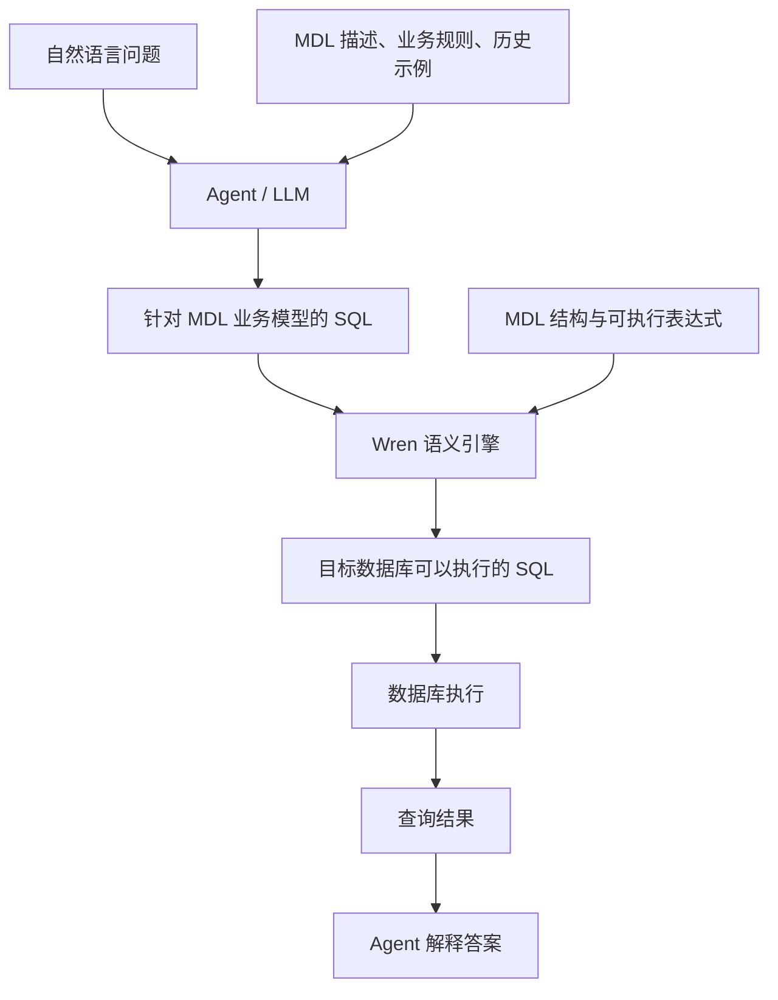

# MDL 详解：从自然语言到可执行 SQL

本文面向已有 Text2SQL 项目经验、希望深入理解 Agent 查询方案的开发者，结合当前 WrenAI 仓库解释 MDL 的作用，以及自然语言问题如何经过业务模型映射、SQL 生成和语义编译，最终变成数据库查询。

分析依据为本地代码快照 `871118e9`。文中的数据、模型和 SQL 为教学示例；展开 SQL 表示概念形态，不是本次实际运行的输出。

## 1. MDL 是什么？

**MDL（Modeling Definition Language，建模定义语言）是一套可执行的业务数据字典。** 它把数据库中的物理表、字段、关联关系和计算公式，定义成 Agent 能理解、引擎能编译的业务模型。

它既提供业务描述，也包含可以参与 SQL 编译的结构化定义。

在 Wren 中，自然语言到 SQL 分成两个不同的过程：



两段转换的责任不同：

| 转换 | 主要执行者 | 核心工作 |
| --- | --- | --- |
| 自然语言 → 模型 SQL | Agent / LLM | 理解需求，选择模型、字段、条件、关联和聚合方式 |
| 模型 SQL → 物理 SQL | Wren 语义引擎 | 展开物理表映射、字段映射、计算列和模型关系 |

**MDL 本身不会理解自然语言，也不是一个训练后的模型。** 自然语言映射仍由 LLM 根据上下文完成；MDL 让映射有明确依据，并让一部分业务逻辑能够被确定性编译。

## 2. 为什么只有数据库 Schema 不够？

假设电商数据库中有下面两张表。

订单表 `dw.t_order`：

| id | uid | pay_amount | refund_amount | pay_time | status |
| --- | --- | ---: | ---: | --- | --- |
| 101 | 1 | 10000 | 2000 | 2026-04-10 | PAID |
| 102 | 1 | 5000 | 0 | 2026-05-20 | PAID |
| 103 | 2 | 20000 | 5000 | 2026-06-15 | PAID |
| 104 | 2 | 8000 | 0 | 2026-06-16 | CANCELLED |
| 105 | 3 | 30000 | 0 | 2026-06-18 | PAID |

客户表 `dw.t_customer`：

| id | name | region_code |
| --- | --- | --- |
| 1 | 张三 | EAST |
| 2 | 李四 | EAST |
| 3 | 王五 | NORTH |

还有一些单靠表名、列名和类型无法可靠推断的业务信息：

- `uid` 是客户 ID。
- 金额存储单位是分。
- 净收入等于支付金额减退款金额。
- 退款金额已经汇总到订单粒度。
- 收入统计只计算 `PAID` 订单。
- `EAST` 对应华东。
- 统计时间按支付时间，而不是订单创建时间。

现在用户提问：

> 2026 年第二季度，华东地区净收入最高的两位客户是谁？收入是多少元？

如果只提供数据库 Schema，模型可能生成语法正确、业务错误的 SQL：

```sql
SELECT uid, SUM(pay_amount)
FROM dw.t_order
GROUP BY uid;
```

这段 SQL 遗漏了地区、季度、订单状态、退款、金额单位转换以及客户名称。

MDL 和业务知识文件的作用，是把这些信息从隐含经验变成明确、可复用的定义。

## 3. 用 MDL 定义订单业务模型

下面是业务项目中 `models/orders/metadata.yml` 的示意内容：

```yaml
name: orders

properties:
  description: 订单分析模型，一行代表一笔订单

table_reference:
  schema: dw
  table: t_order

primary_key: order_id

columns:
  - name: order_id
    type: BIGINT
    expression: id

  - name: customer_id
    type: BIGINT
    expression: uid

  - name: paid_amount_cents
    type: BIGINT
    expression: pay_amount

  - name: refunded_amount_cents
    type: BIGINT
    expression: refund_amount

  - name: paid_at
    type: TIMESTAMP
    expression: pay_time

  - name: order_status
    type: VARCHAR
    expression: status

  - name: net_revenue
    type: DOUBLE
    is_calculated: true
    expression: >
      (paid_amount_cents - COALESCE(refunded_amount_cents, 0)) / 100.0
    properties:
      description: 订单净收入，单位为元，支付金额减退款金额

  - name: customer
    type: customers
    relationship: orders_customers
```

### 3.1 模型名与物理表映射

```yaml
name: orders
table_reference:
  schema: dw
  table: t_order
```

Agent 查询的是业务模型 `orders`，实际数据来自物理表 `dw.t_order`。

业务模型名称可以保持稳定；物理表改名或迁移时，可以调整映射，而不必让每条业务查询都跟着修改。能否完全兼容还取决于字段和业务口径是否保持一致。

### 3.2 业务字段与物理字段映射

```yaml
- name: customer_id
  type: BIGINT
  expression: uid
```

这里向业务侧暴露 `customer_id`，底层读取 `uid`。未标记为计算列时，这种 `expression` 用于简单列引用与重命名。

这能减少物理缩写、历史命名和业务概念之间的理解成本。

### 3.3 计算列

```yaml
- name: net_revenue
  type: DOUBLE
  is_calculated: true
  expression: >
    (paid_amount_cents - COALESCE(refunded_amount_cents, 0)) / 100.0
```

这里定义了一个虚拟计算列：

```text
净收入（元） =（支付金额（分）− 退款金额（分））÷ 100
```

数据库不必真正存在 `net_revenue` 字段。查询时，引擎根据表达式展开它。

`COALESCE` 将空退款金额按零处理，`100.0` 表示示例中的金额单位转换。实际金融统计应根据数据源和精度要求选择合适的 DECIMAL 类型；这里使用 DOUBLE 是为了聚焦语义映射过程。

### 3.4 描述与可执行定义的区别

| MDL 内容 | 主要作用 |
| --- | --- |
| `properties.description` | 帮助 Agent 理解字段或模型 |
| `table_reference` | 引擎确定物理数据位置 |
| 简单列 `expression` | 引擎完成字段映射 |
| `is_calculated` + `expression` | 引擎展开计算逻辑 |
| `relationship` | 声明到其他模型的关系路径 |

**只写“净收入需要扣除退款”的描述，不会自动让引擎为所有 SQL 加上退款逻辑。** 真正可执行的公式必须定义在计算表达式等结构化位置。

## 4. 定义客户模型与关联关系

客户模型 `models/customers/metadata.yml`：

```yaml
name: customers

properties:
  description: 客户维度，一行代表一位客户

table_reference:
  schema: dw
  table: t_customer

primary_key: customer_id

columns:
  - name: customer_id
    type: BIGINT
    expression: id

  - name: customer_name
    type: VARCHAR
    expression: name

  - name: region
    type: VARCHAR
    expression: region_code
    properties:
      description: 地区编码，EAST 表示华东，NORTH 表示华北
```

关系文件 `relationships.yml`：

```yaml
relationships:
  - name: orders_customers
    models:
      - orders
      - customers
    join_type: MANY_TO_ONE
    condition: orders.customer_id = customers.customer_id
```

它表达的是：

```text
多笔订单 → 一位客户
关联条件：订单.customer_id = 客户.customer_id
```

关系基数与统计正确性密切相关。如果客户表的 `customer_id` 唯一，订单关联客户后通常不会增加订单行数。如果客户表存在重复 ID，JOIN 仍可能放大收入。

**声明主键和关系不等于自动清洗真实数据。** 实际数据必须符合建模假设。

模型中的关系字段为跨模型引用提供路径，尤其可用于计算字段表达式。为了让本例的查询过程清晰，后续示例由 Agent 显式写出 JOIN；这个显式 JOIN 使用已定义的关联条件，但不需要引擎再自动推断 JOIN。

## 5. MDL 与业务知识文件怎样分工？

可以在 `knowledge/rules/revenue.md` 中补充：

```markdown
收入分析规则：

- “净收入”使用 orders.net_revenue，单位为人民币元。
- 只统计 order_status = 'PAID' 的订单。
- 收入所属期间按 paid_at 判断。
- 本数据集 paid_at 已统一为北京时间的无时区时间。
- “华东”对应 customers.region = 'EAST'。
- 退款金额已经按订单汇总。
```

这里的时间说明是本教学数据的假设；如果实际数据存储 UTC 或带时区时间，需要根据业务时区转换边界。

| 信息 | 主要消费者 | 是否直接参与引擎编译 |
| --- | --- | --- |
| 物理表映射 | 引擎 | 是 |
| 字段重命名 | 引擎 | 是 |
| 计算列表达式 | 引擎 | 是 |
| 关系条件 | 引擎、Agent | 使用关系展开时参与 |
| “只统计 PAID”的 Markdown 规则 | Agent | 否，由 Agent 写进 SQL |
| “华东对应 EAST”的业务说明 | Agent | 否，由 Agent 完成值映射 |

当前项目中，业务规则文件由 Agent 消费，不作为这些规则的可执行表达式写入 `target/mdl.json`。

因此，**写进 Markdown 的规则，不代表数据库查询时必然强制执行。**

如果“只统计已支付订单”是必须固定的模型口径，可以通过带过滤条件的 `ref_sql` 定义专门的分析模型，或提供封装该逻辑的视图。例如模型的数据来源可以使用以下形式：

```sql
SELECT *
FROM dw.t_order
WHERE status = 'PAID'
```

这会把筛选固化到该模型的数据定义中。若要求所有访问都遵守约束，还需要控制能否绕过该模型访问其他对象，不能仅依赖一个模型定义。

做 Agent 系统时，应明确区分：

- **指导信息**：给模型阅读，帮助它做出正确选择。
- **执行约束**：由代码、查询结构或数据库权限实际执行。

## 6. 自然语言如何映射到 MDL？

用户问题：

> 2026 年第二季度，华东地区净收入最高的两位客户是谁？收入是多少元？

Agent 先读取或检索模型描述、相关字段、业务规则，必要时召回相似问题的 SQL 示例，然后建立对应关系：

| 自然语言片段 | 对应业务语义 | SQL 中的体现 |
| --- | --- | --- |
| 客户是谁 | 客户 ID、客户名称 | SELECT、GROUP BY |
| 净收入 | `orders.net_revenue` | `SUM(net_revenue)` |
| 2026 年第二季度 | 支付时间在 4 月至 6 月 | 时间过滤 |
| 华东地区 | `customers.region = 'EAST'` | 地区过滤 |
| 最高的两位 | 收入降序，取前两位 | ORDER BY、LIMIT |
| 收入多少元 | `net_revenue` 已是元 | 不再除以 100 |
| 收入口径规则 | 只统计已支付订单 | 状态过滤 |

这里发生了三个不同层次的映射：

```text
Schema Linking（结构对齐）：
“客户”   → customers
“净收入” → orders.net_revenue

Value Linking（值对齐）：
“华东”   → EAST
“已支付” → PAID

查询结构生成：
“每位客户” → GROUP BY
“最高两位” → ORDER BY DESC + LIMIT 2
```

这些工作由 LLM 根据上下文完成，不是 MDL 解析器根据中文关键词自动替换。

可以把提供给模型的上下文简化理解为：

```text
问题：
2026 年第二季度华东地区净收入最高的两位客户是谁？

可用模型：
orders(...)
customers(...)

指标定义：
net_revenue = 支付减退款，单位元

关联：
orders.customer_id = customers.customer_id

规则：
仅 PAID，按 paid_at，华东 = EAST

任务：
生成查询这些业务模型的 SQL。
```

这一阶段 MDL 帮助模型选择正确对象，还没有开始语义编译。若问题中的指标含义或时间范围存在歧义，Agent 仍应澄清，不能因为存在 MDL 就假设所有问题都有唯一解释。

## 7. Agent 生成针对 MDL 的 SQL

Agent 可以生成如下语义 SQL：

```sql
SELECT
    c.customer_id,
    c.customer_name,
    SUM(o.net_revenue) AS total_net_revenue
FROM orders AS o
JOIN customers AS c
    ON o.customer_id = c.customer_id
WHERE o.order_status = 'PAID'
  AND o.paid_at >= TIMESTAMP '2026-04-01 00:00:00'
  AND o.paid_at <  TIMESTAMP '2026-07-01 00:00:00'
  AND c.region = 'EAST'
GROUP BY
    c.customer_id,
    c.customer_name
ORDER BY
    total_net_revenue DESC,
    c.customer_id
LIMIT 2;
```

这段 SQL 有几个特点：

- 查询模型 `orders`，没有使用物理表 `dw.t_order`。
- 使用 `customer_id`，没有使用物理字段 `uid`。
- 使用虚拟列 `net_revenue`，没有重复编写退款和单位转换公式。
- 使用左闭右开的时间区间，包含第二季度所有时刻。
- 按客户 ID 与名称一起分组，避免同名客户合并。
- 收入相同时按客户 ID 排序，使结果顺序稳定。

**这一层仍然是 SQL，只是查询对象属于业务语义层。**

不需要每来一个问题都重新生成 MDL。MDL 是预先维护的可复用模型；不同问题生成不同 SQL，复用同一套定义。

## 8. 引擎如何把语义 SQL 编译成物理 SQL？

当前 Wren Python 查询路径大致执行以下步骤：

```text
解析 SQL
  → 执行策略检查
  → 找出 orders、customers 及所需字段
  → 提取相关 MDL 定义
  → 调用 Rust 引擎展开模型字段和计算表达式
  → 生成模型 CTE
  → 保留外层查询的过滤、聚合、排序
  → 输出目标数据库方言 SQL
  → 检查展开后的 SQL
```

具体映射包括：

```text
orders                  → dw.t_order
orders.customer_id      → dw.t_order.uid
orders.paid_at          → dw.t_order.pay_time
orders.order_status     → dw.t_order.status

orders.net_revenue
  → (pay_amount - COALESCE(refund_amount, 0)) / 100.0

customers               → dw.t_customer
customers.customer_name → dw.t_customer.name
customers.region        → dw.t_customer.region_code
```

编译后 SQL 的概念形态如下：

```sql
WITH orders AS (
    SELECT
        uid AS customer_id,
        pay_time AS paid_at,
        status AS order_status,
        (
            pay_amount - COALESCE(refund_amount, 0)
        ) / 100.0 AS net_revenue
    FROM dw.t_order
),
customers AS (
    SELECT
        id AS customer_id,
        name AS customer_name,
        region_code AS region
    FROM dw.t_customer
)
SELECT
    c.customer_id,
    c.customer_name,
    SUM(o.net_revenue) AS total_net_revenue
FROM orders AS o
JOIN customers AS c
    ON o.customer_id = c.customer_id
WHERE o.order_status = 'PAID'
  AND o.paid_at >= TIMESTAMP '2026-04-01 00:00:00'
  AND o.paid_at <  TIMESTAMP '2026-07-01 00:00:00'
  AND c.region = 'EAST'
GROUP BY
    c.customer_id,
    c.customer_name
ORDER BY
    total_net_revenue DESC,
    c.customer_id
LIMIT 2;
```

CTE 是查询中的临时命名表达式，不意味着需要在数据库里创建新表，也不意味着它一定被物化。

这一阶段主要基于 SQL AST、逻辑计划和规则完成转换，不需要 LLM 再猜一次怎样替换字段或计算净收入。实际引擎生成的 SQL 可能包含不同的引用符、别名、投影和嵌套。

### 8.1 对应源码调用链

```text
WrenEngine.query()
  → dry_plan()
    → _plan()
      → sqlglot 解析与策略检查
      → ManifestExtractor.extract_by()
      → CTERewriter.rewrite()
        → 为所需模型构造模型查询
        → SessionContext.transform_sql()
          → Rust / DataFusion 逻辑计划
          → 语义分析与优化
          → 输出模型展开 SQL
        → 注入模型 CTE，生成目标方言 SQL
      → validate_planned_sql()
  → connector.query()
  → Arrow 结果
```

此处描述的是本例的模型查询路径。当前 Python CTE 改写对 View 有单独处理：View 的原生 SQL statement 作为 CTE 保留，其依赖模型先展开，不能把所有对象都理解为相同的 Rust 调用路径。

### 8.2 从 YAML 到引擎定义

项目中的 YAML 通过 `wren context build` 编译为 `target/mdl.json`。YAML 使用 snake_case，JSON 使用 camelCase，例如：

| YAML | 编译后的 JSON |
| --- | --- |
| `table_reference` | `tableReference` |
| `is_calculated` | `isCalculated` |
| `primary_key` | `primaryKey` |
| `join_type` | `joinType` |

这一步主要准备引擎消费的结构化模型，不是把自然语言问题编译成 SQL。

## 9. 校验、执行与答案生成

在实际工作流中，可以先执行规划或数据库侧预检：

| 操作 | 作用 | 不能保证什么 |
| --- | --- | --- |
| `dry_plan` | 检查并生成展开 SQL，不需要连接数据库 | 不能证明物理表存在或业务口径正确 |
| `dry_run` | 通过相应连接器做数据库侧预检 | 不能证明答案满足业务问题 |
| `query` | 规划并实际查询数据 | 执行成功不等于业务正确 |

对于前面的教学数据，结果应按以下过程计算：

| 客户 | 计算过程 | 净收入 |
| --- | --- | ---: |
| 张三 | `(10000−2000)/100 + 5000/100` | 130 元 |
| 李四 | `(20000−5000)/100` | 150 元 |

订单 104 为 `CANCELLED`，不参与收入计算；王五属于 `NORTH`，被地区条件排除；参与计算的订单都在第二季度。

预期结果：

```text
customer_id | customer_name | total_net_revenue
------------+---------------+------------------
2           | 李四          | 150.0
1           | 张三          | 130.0
```

Agent 据此生成答案：

> 2026 年第二季度，华东地区净收入最高的两位客户是李四（150 元）和张三（130 元）。统计仅包含已支付订单，净收入已扣除订单退款。

这里的数值应来自真实执行结果，Agent 负责解释。本文数字由教学数据手工推导，不表示已运行数据库。

## 10. MDL 能解决什么，不能解决什么？

| 问题 | MDL 的作用 | 仍然需要完成的工作 |
| --- | --- | --- |
| 物理字段名难理解 | 提供清晰业务命名 | Agent 正确选择业务字段 |
| 收入公式重复生成且不一致 | 固定计算表达式 | 正确选择收入指标 |
| 关联条件靠猜 | 明确模型关系 | 选择合适关联，核查真实数据粒度 |
| “华东”对应什么编码 | 提供字段描述或配套知识 | Agent 完成值映射 |
| “本季度”定义不明确 | 提供时间口径上下文 | 必要时请求澄清 |
| SQL 生成错误 | 规划阶段发现一部分问题 | 分类修复、限制重试 |
| SQL 能执行但答案错误 | 提供更稳定的语义基础 | 业务核验与结果评测 |

还应避免三个误解：

1. **MDL 不是物理数据仓库。** 它定义数据如何被理解与查询，不自动修复源数据质量。
2. **MDL 不是业务正确性的证明。** 建模公式本身可能写错，模型与知识也可能过期。
3. **有 MDL 不代表完全消除幻觉。** Agent 仍可能选错指标、遗漏条件或误解问题，需要验证流程。

## 11. 对已有 Text2SQL 项目的借鉴

对于已有 Text2SQL 项目、目标为 Agent 开发的学习者，可以重点借鉴这种责任划分：

> 把稳定、重复、可确定的业务逻辑放进语义层；让 Agent 负责需求理解、上下文选择、工具调用与异常处理。

例如，“金额分转元、扣除退款”不必每次让模型重写；“用户说的收入到底指净收入还是成交总额”，则仍需要上下文理解或澄清。

可以按以下顺序改造自己的项目：

1. 选择一个经常出错的业务指标，把字段映射、公式、单位和粒度定义成可维护的模型。
2. 把 Schema、业务规则和相似 SQL 示例作为不同来源的上下文提供给 Agent。
3. 将上下文获取、SQL 规划、数据库预检与执行封装为独立工具。
4. 为失败增加分类：字段错误、方言错误、连接错误、业务歧义分别处理。
5. 用相同问题集比较改造前后的结果正确率、成本和延迟。

这些是可实践的改造建议，不代表你之前的项目缺少这些能力。是否需要引入完整 MDL，应由业务口径复杂度、模型复用需求和维护成本决定。

## 12. 源码阅读入口

建议按以下顺序阅读：

| 文件 | 阅读重点 |
| --- | --- |
| [MDL 参考文档](../core/reference/mdl.md) | 模型、列、关系、View、Cube 与知识文件 |
| [context.py](../../core/wren/src/wren/context.py) | 项目文件与 Manifest 构建 |
| [engine.py](../../core/wren/src/wren/engine.py) | SQL 规划、检查与执行入口 |
| [cte_rewriter.py](../../core/wren/src/wren/mdl/cte_rewriter.py) | 模型展开、字段收集与 CTE 注入 |
| [Python 绑定 context.rs](../../core/wren-core-py/src/context.rs) | Python 到 Rust 的调用边界 |
| [Rust mdl/mod.rs](../../core/wren-core/core/src/mdl/mod.rs) | 语义分析、逻辑计划、优化与 SQL 输出 |
| [LangGraph 示例](../../sdk/wren-langchain/examples/langgraph_demo.py) | 模型与工具如何构成 Agent 循环 |

完整项目架构、Text2SQL 工作流与学习路线见 [项目中文学习指南](../../README.zh-CN.md)。
